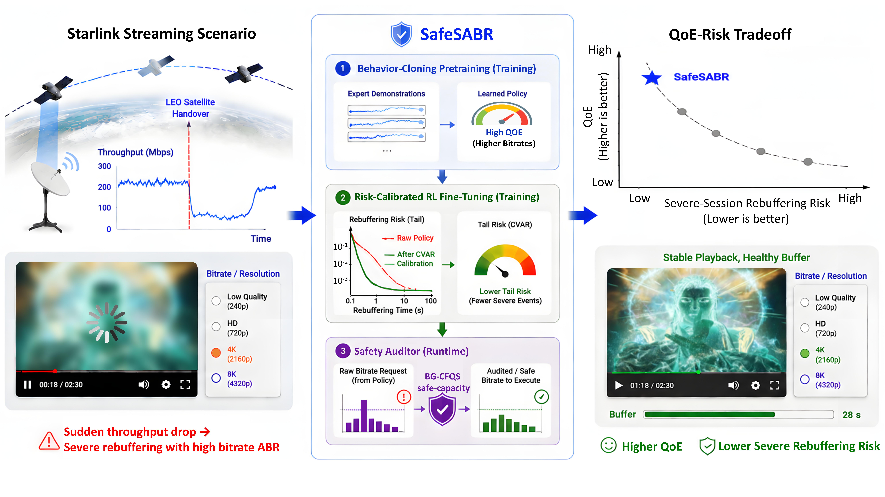
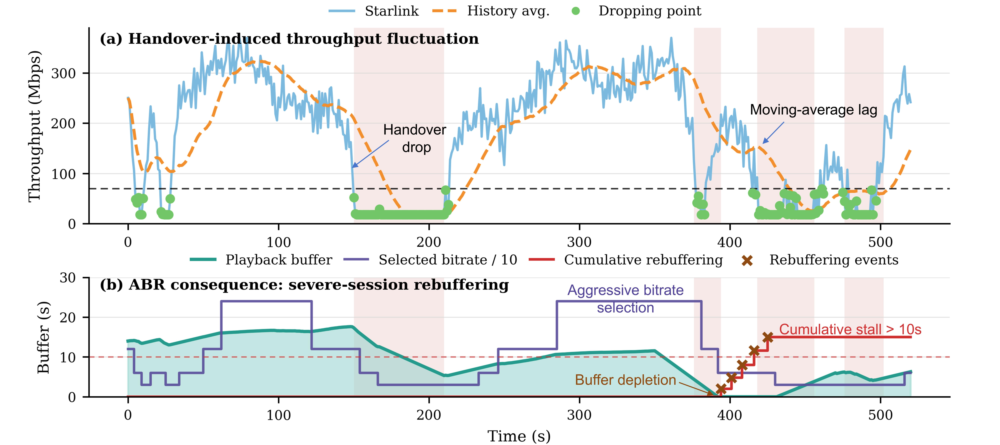
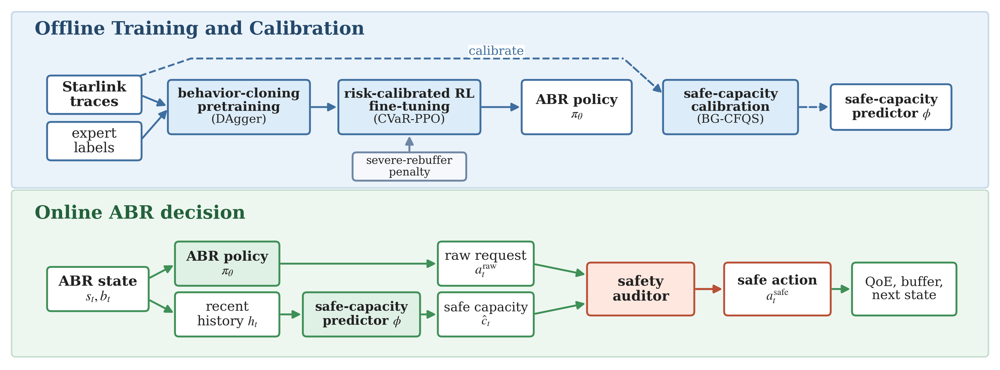
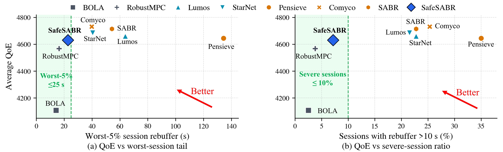

# SafeSABR

**Risk-calibrated adaptive bitrate streaming over Starlink networks.**

SafeSABR is a learned adaptive bitrate (ABR) framework for high-bitrate video streaming over volatile Starlink access links. It targets a practical failure mode that is easy to miss with average QoE alone: a learned ABR policy may keep requesting aggressive high-bitrate chunks during handover-induced throughput drops, causing severe session-level rebuffering.

> Paper: arXiv link coming soon.

<p align="center">
  
</p>

## Why SafeSABR?

Starlink makes high-bitrate video streaming possible in areas where terrestrial broadband is unavailable, but its access throughput can change rapidly because of satellite mobility and handovers. This creates a QoE--severe-risk tradeoff: aggressive bitrate selection improves average quality when the link is strong, but a few bad decisions during abrupt drops can drain the playback buffer and produce long stalls.

<p align="center">
  
</p>

SafeSABR addresses this with a three-stage design:

1. **Behavior-cloning pretraining** learns a high-QoE ABR prior from an expert policy.
2. **Risk-calibrated RL fine-tuning** penalizes severe rebuffering tails so the policy becomes less prone to high-risk actions.
3. **Runtime safety auditing** checks the policy-requested bitrate against a safe-capacity estimate before execution.

<p align="center">
  
</p>

## Repository Scope

This repository provides the core SafeSABR implementation:

- SafeSABR training code for behavior-cloning pretraining and risk-calibrated PPO fine-tuning.
- Runtime safety-auditing code for safe-capacity-guided bitrate correction.
- StarNet-to-SABR trace conversion utilities.
- Synthetic high-bitrate video-size generation utilities for 4K/8K-style ABR experiments.
- Paper figures for explaining the problem setting and SafeSABR design.

## Repository Layout

```text
SafeSABR/
├── assets/                    # Paper-style figures for README and project page
├── docs/                      # Data and reproduction notes
├── safesabr/                  # Core SafeSABR code
│   ├── train_sabr.py          # Entry point for BC + RL fine-tuning
│   ├── train_sabr_logged.py   # Structured training/logging implementation
│   ├── evaluate_action_shield.py
│   ├── test_ppo_sb.py         # Evaluation loop with runtime safety auditing
│   ├── sim_env/               # ABR simulator wrappers
│   ├── rl/                    # Behavior-cloning / DAgger utilities
│   ├── utils_tool/            # Evaluation and logging helpers
│   └── build_env_c_plus/      # C++ expert backend for behavior cloning
└── tools/
    ├── prepare_starlink_traces.py
    ├── make_synthetic_video_size.py
    └── export_predictor_safe_caps.py
```

## Data

SafeSABR uses Starlink measurement traces derived from the StarNet dataset:

https://github.com/ConnectedSystemsLab/StarNet

The dataset is not redistributed in this repository. Please download or prepare the StarNet processed throughput files separately, then follow [docs/DATA.md](docs/DATA.md) to convert them into SABR replay traces.

## Quick Start

Create the environment:

```bash
conda env create -f environment.yml
conda activate safesabr
```

Generate the synthetic high-bitrate video-size files:

```bash
python tools/make_synthetic_video_size.py
```

Prepare StarNet-derived SABR traces after placing processed StarNet files under `data/starnet_pkl`:

```bash
python tools/prepare_starlink_traces.py --source-root data/starnet_pkl
```

Build the C++ expert backend used by behavior-cloning pretraining:

```bash
cd safesabr
bash build_env_c_plus/build_rl.sh
```

Train a SafeSABR policy:

```bash
python train_sabr.py 1 0 4 100000 \
  --seed 42 \
  --risk-mode cvar_rebuf \
  --risk-alpha 0.95 \
  --risk-lambda 20 \
  --run-name safesabr_seed42
```

Evaluate with runtime safety auditing:

```bash
python evaluate_action_shield.py \
  --log-root ./experiment_logs/starlink_high \
  --model-dir ./experiment_logs/starlink_high/<run-id>/models/rl_model/ppo \
  --model-label safesabr \
  --shield external_predictor \
  --external-predictor-file ./experiment_logs/starlink_high/predictor_safe_caps/BG-CFQS_safe_caps.csv \
  --external-predictor-name BG-CFQS \
  --shield-margin 0.90 \
  --shield-low-buffer-margin 0.90
```

See [docs/REPRODUCE.md](docs/REPRODUCE.md) for the intended full workflow.

## Result Snapshot

The paper evaluates SafeSABR by the QoE--severe-risk operating point rather than average QoE alone.

<p align="center">
  
</p>
